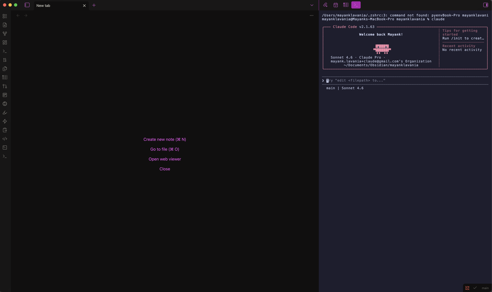
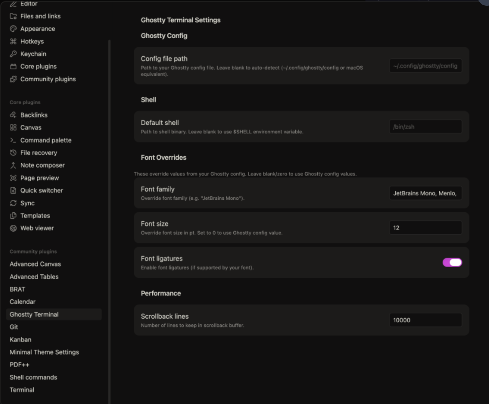

# Ghostty Terminal for Obsidian

> A true Ghostty-powered terminal pane embedded inside Obsidian — same VT parser as the native Ghostty app, no Electron quirks, no xterm.js compromises.

[](https://obsidian.md)
[](./manifest.json)
[](./manifest.json)
[](./LICENSE)

---

## What is this?

**Ghostty Terminal** embeds a fully functional, real terminal inside your Obsidian vault pane. Under the hood it uses:

- **[ghostty-web](https://github.com/ghostty-org/ghostty)** — the official Ghostty VT parser compiled to WebAssembly (WASM). This is the same `libghostty-vt` engine that powers the native Ghostty terminal app on macOS and Linux.
- **A Python PTY proxy** (`pty_helper.py`) — spawns your actual shell in a real pseudo-terminal (PTY) and proxies I/O between it and the WASM terminal renderer. Uses Python's stdlib `pty` module — no native Node addons required.
- **Canvas renderer** — `ghostty-web`'s `CanvasRenderer` draws the terminal to a `<canvas>` element pixel-perfectly using exact font metrics.

This is **not** a wrapper around xterm.js. You get real Ghostty VT semantics: proper Unicode (grapheme clusters, wide chars), 256-color + truecolor, OSC 8 hyperlinks, Kitty graphics protocol, and more.


## Screenshots




---

## Features

| Feature | Details |
|---|---|
| 🖥️ **Real Ghostty VT parser** | `ghostty-web` WASM — identical behavior to native Ghostty |
| 🎨 **Your Ghostty config** | Auto-reads `~/.config/ghostty/config` — font, font size, full 16-color palette |
| 📐 **Pixel-perfect resize** | Canvas measures exact character cell dimensions; columns never misalign |
| 🪟 **Multiple terminals / splits** | Each pane is fully independent; open as many as you need |
| 📁 **File Explorer context menu** | Right-click any file or folder → **Open Ghostty Terminal here** |
| 🔁 **Shell restart button** | If the shell exits, a ⟳ button appears inline — no plugin reload needed |
| ⚙️ **Settings override** | Override shell, font, font size, and scrollback from Obsidian Settings |
| 🚫 **No native addons** | Uses Python `pty` stdlib instead of `node-pty` — no `electron-rebuild` needed |

---

## Requirements

| Requirement | Minimum version |
|---|---|
| [Obsidian](https://obsidian.md) | 1.6.0 (desktop only) |
| macOS / Linux | Any modern version |
| Python | 3.8+ (ships with macOS and most Linux distros) |
| Node.js | 18+ *(only needed to build from source)* |

> **Windows:** The PTY proxy does not currently support Windows. macOS and Linux are fully supported.

---

## Installation

### Option A — BRAT (recommended for early access)

[BRAT](https://github.com/TfTHacker/obsidian42-brat) lets you install plugins directly from GitHub without waiting for community approval.

1. Install the **BRAT** plugin from Obsidian Community Plugins
2. Open BRAT settings → **Add Beta Plugin**
3. Enter the repository URL:
   ```
   https://github.com/mayanklavania/obsidian-ghostty-terminal
   ```
4. Click **Add Plugin** — BRAT will download and install it automatically
5. Go to **Settings → Community plugins** and enable **Ghostty Terminal**

### Option B — Manual install from GitHub release

1. Go to the [Releases page](https://github.com/mayanklavania/obsidian-ghostty-terminal/releases) and download the latest release assets:
   - `main.js`
   - `manifest.json`
   - `styles.css`
   - `pty_helper.py`

2. Create the plugin folder in your vault:
   ```bash
   mkdir -p /path/to/your-vault/.obsidian/plugins/ghostty-terminal
   ```

3. Copy the downloaded files into that folder

4. In Obsidian: **Settings → Community plugins → Toggle "Restricted mode" OFF → Enable "Ghostty Terminal"**

### Option C — Build from source

```bash
# 1. Clone the repo
git clone https://github.com/mayanklavania/obsidian-ghostty-terminal
cd obsidian-ghostty-terminal

# 2. Install dependencies
npm install

# 3. Build
npm run build

# 4. Copy plugin files to your vault
VAULT=~/path/to/your-vault
mkdir -p "$VAULT/.obsidian/plugins/ghostty-terminal"
cp main.js manifest.json styles.css pty_helper.py "$VAULT/.obsidian/plugins/ghostty-terminal/"

# 5. Enable in Obsidian
# Settings → Community plugins → Enable "Ghostty Terminal"
```

#### Development (hot-reload)

```bash
# Symlink the repo directly into your vault's plugins folder for development
ln -s "$(pwd)" ~/path/to/your-vault/.obsidian/plugins/ghostty-terminal

# Start the watcher — rebuilds on every save
npm run dev
```

Install the [Hot-Reload plugin](https://github.com/pjeby/hot-reload) in Obsidian to auto-reload the plugin on file change.

---

## Usage

### Opening a terminal

| Action | How |
|---|---|
| Open terminal | Click the **terminal** icon in the left ribbon, or run command **"Open Ghostty Terminal"** |
| Open in new split | Command palette: **"Open Ghostty Terminal in new split"** |
| Open at a specific path | Right-click any file or folder in the File Explorer → **"Open Ghostty Terminal here"** |
| Restart shell | Click the **⟳ Restart shell** button that appears when the shell exits |

### Keyboard shortcuts

You can assign custom hotkeys to **"Open Ghostty Terminal"** via **Settings → Hotkeys**.

---

## Configuration

### Ghostty config auto-detection

The plugin automatically reads your Ghostty config from:
- **macOS:** `~/Library/Application Support/com.mitchellh.ghostty/config`
- **Linux:** `~/.config/ghostty/config`

The following config keys are recognized:

| Ghostty key | Effect |
|---|---|
| `font-family` | Terminal font family |
| `font-size` | Terminal font size (pt) |
| `background` | Background color |
| `foreground` | Foreground/text color |
| `cursor-color` | Cursor color |
| `palette = N=RRGGBB` | All 16 ANSI color entries |
| `cursor-style` | `block` / `underline` / `bar` |
| `cursor-style-blink` | `true` / `false` |
| `scrollback-limit` | Lines of scrollback buffer |
| `command` | Default shell command |

### Plugin settings

Override any Ghostty config value from **Obsidian → Settings → Ghostty Terminal**:

| Setting | Default | Description |
|---|---|---|
| Config file path | *(auto-detect)* | Explicit path to your Ghostty config file |
| Default shell | `$SHELL` env var | Shell binary to spawn (e.g. `/bin/fish`) |
| Font family override | *(from Ghostty config)* | Override font, e.g. `"Fira Code"` |
| Font size override | *(from Ghostty config)* | Point size, e.g. `14` |
| Scrollback lines | `10000` | Number of lines in the scrollback buffer |

---

## Architecture

```
obsidian-ghostty-terminal/
├── main.ts                   Plugin entry + GhosttyTerminalView
│                               - Registers view, ribbon, commands, context menu
│                               - Boots ghostty-web WASM on startup
│                               - Manages Terminal lifecycle (init, resize, dispose)
│                               - Spawns pty_helper.py and proxies I/O
├── src/
│   ├── ghostty-config.ts     Ghostty config file parser
│   │                           - Auto-detects config location on macOS + Linux
│   │                           - Parses font, colors, cursor, scrollback, shell
│   └── settings.ts           Plugin settings schema + Obsidian SettingTab UI
├── pty_helper.py             Python PTY proxy (Unix only)
│                               - Forks a real PTY via Python stdlib `pty.fork()`
│                               - Proxies stdin/stdout between JS and shell
│                               - Reads 4-byte resize frames on fd 3 (rows, cols)
│                               - Calls TIOCSWINSZ to resize the PTY kernel window
├── styles.css                Plugin CSS — scoped .ghostty-* classes
├── manifest.json             Obsidian plugin manifest
└── esbuild.config.mjs        Build config — bundles main.ts + ghostty-web WASM
```

### How the PTY bridge works

```
Obsidian (Electron/Node.js)
        │
        ▼
  child_process.spawn("python3 pty_helper.py /bin/zsh")
        │ stdin  ──────────────────────────────► PTY master fd
        │ stdout ◄────────────────────────────── PTY master fd
        │ stdio[3] (resize pipe, write-only) ──► ioctl TIOCSWINSZ
        │
        ▼
  ghostty-web Terminal (WASM + Canvas)
    - terminal.write(data)    ← stdout bytes from PTY
    - terminal.onData(cb)     → stdin bytes to PTY
    - terminal.resize(c, r)   → 4-byte frame to resize pipe
```

### Why Python instead of node-pty?

`node-pty` is a native Node.js addon that requires recompilation against Electron's version of V8 (`electron-rebuild`). This is fragile and breaks on Obsidian updates. Python's `pty` module is part of the standard library and works out of the box on any macOS or Linux machine — no compilation needed.

---

## Troubleshooting

### Terminal shows "pty_helper.py not found"

Make sure `pty_helper.py` is in the same folder as `main.js` inside `.obsidian/plugins/ghostty-terminal/`. If you installed from source, re-run the copy step.

### Shell doesn't start / shows Python error

1. Verify Python 3 is available: `which python3`
2. Check Obsidian's developer console (**View → Toggle Developer Tools → Console**) for the full error

### Font looks wrong or spacing is off

Set an explicit font in **Settings → Ghostty Terminal → Font family override**. Use a monospace font installed on your system, e.g. `"Menlo"`, `"Monaco"`, `"Fira Code"`, or `"JetBrains Mono"`.

### Colors don't match my Ghostty theme

The plugin reads your Ghostty config automatically. If colors look wrong:
1. Check **Settings → Ghostty Terminal → Config file path** — leave blank for auto-detection
2. Open the developer console and look for a `[GhosttyTerminal] config:` log line to see what was parsed

---

## Contributing

Pull requests are welcome! Please:

1. Fork the repo and create a feature branch
2. Run `npm run build` to verify there are no TypeScript errors
3. Test in Obsidian with a real vault before submitting

---

## Roadmap

- [ ] Obsidian theme sync (auto-switch light/dark palette)
- [ ] OSC 633 shell integration (prompt anchoring, command detection)
- [ ] Tab bar for multiple terminals in a single pane
- [ ] Windows support via ConPTY
- [ ] Submit to Obsidian Community Plugins registry

---

## License

MIT © [Mayank Lavania](https://github.com/mayanklavania)
